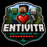

<div align="center">
  <a href="https://github.com/othneildrew/Best-README-Template">
    
  </a>

# Entivita

**Minecraft 26.2 · Fabric · Client-Side Health Indicator**

Entivita is a client-side Fabric mod for Minecraft 26.2 that displays health information for living entities and heart indicators for other players.

The project focuses on providing clear, lightweight health information during gameplay while using Minecraft's existing health and heart systems.

[](https://github.com/www0abdb-oss/entivita/releases)
[](https://github.com/www0abdb-oss/entivita/tags)
[](https://github.com/www0abdb-oss/entivita/stargazers)
[](https://www.minecraft.net/)
[](https://fabricmc.net/)
[](https://www.oracle.com/java/)
[](LICENSE)

## Features

- Displays current and maximum health for living entities.
- Displays heart indicators for other players.
- Supports Minecraft heart and absorption states.
- Allows health indicator rendering to be enabled or disabled.
- Supports heart stacking.
- Supports vertical heart offset adjustment.
- Uses Minecraft's existing heart textures.
- Designed as a client-side mod.

## Requirements

- Minecraft Java Edition 26.2
- Fabric Loader 0.19.3 or newer
- Java 25 or newer
- Fabric API

## Installation

1. Install Fabric Loader for Minecraft 26.2.
2. Install the required Fabric API version.
3. Download the latest Entivita release.
4. Place the Entivita JAR in your Minecraft `mods` folder.
5. Launch Minecraft using Fabric.

Entivita is a client-side mod and does not require Entivita to be installed on the server.

## Configuration

Entivita stores its configuration in:

```text
config/entivita.json
```

Current options:

- `renderingEnabled` — enables or disables health indicator rendering.
- `heartStackingEnabled` — controls heart stacking behavior.
- `heartOffset` — controls the vertical position of heart indicators.

The related key bindings can be assigned through Minecraft's standard Controls menu.

## Development Status

Entivita is currently under active development for Minecraft 26.2.

Rendering, configuration, and compatibility may change as development continues.

## Building From Source

```bash
git clone https://github.com/www0abdb-oss/entivita.git
cd entivita
./gradlew clean build
```

Built JAR files are generated in:

```text
build/libs/
```

## Contributing

Bug reports, testing, documentation improvements, and pull requests are welcome.

When reporting an issue, include:

- Entivita version
- Minecraft version
- Fabric Loader version
- Fabric API version
- Other installed mods
- Steps to reproduce the issue
- Relevant crash report or game log

## Links

- [GitHub Repository](https://github.com/www0abdb-oss/entivita)
- [GitHub Releases](https://github.com/www0abdb-oss/entivita/releases)
- [Modrinth](https://modrinth.com/project/entivita)
- [Discord](https://discord.gg/qECjtAhKD)
- [Instagram](https://www.instagram.com/www0abdb2026)
- [YouTube](https://youtube.com/@abd_errahim-mine)

## License

Entivita is licensed under the [Apache License 2.0](LICENSE).

## Disclaimer

Entivita is an independent project and is not affiliated with, endorsed by, or sponsored by Mojang Studios or Microsoft.

---
### Top contributors:

<a href="https://github.com/www0abdb-oss/entivita/graphs/contributors">
  
</a>

---
<p align="center" style="color:#5555; font-size:0.9rem;">Client-side · Lightweight ·  For PVP and Survival</p>

---

<p align="center" style="margin-top:40px; color:#5555; font-size:0.8rem;">Keywords: client-side, entity-health, entivita, fabric, fabric-mod, health, health-check, health-display, health-indicator, health-indicators, hud, minecraft, pvp</p>

* [Entivita](https://github.com/www0abdb-oss/entivita)
